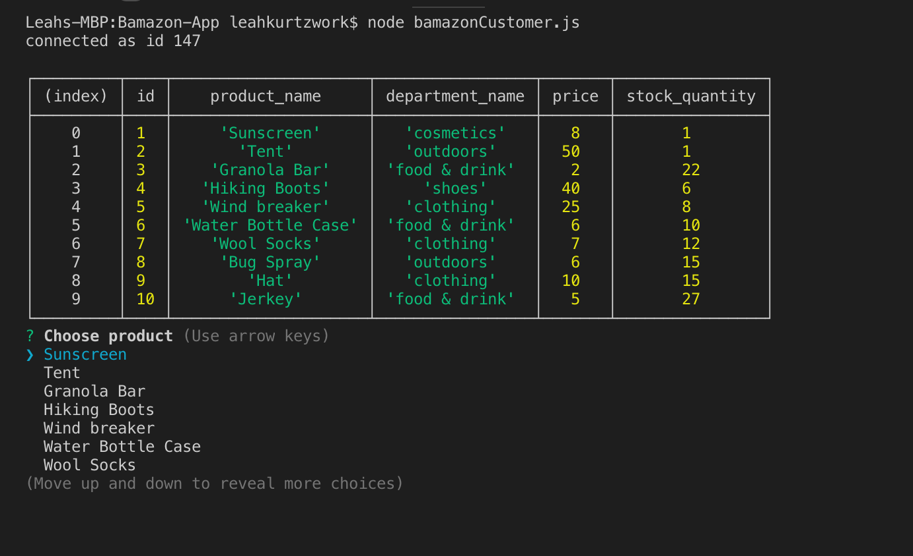
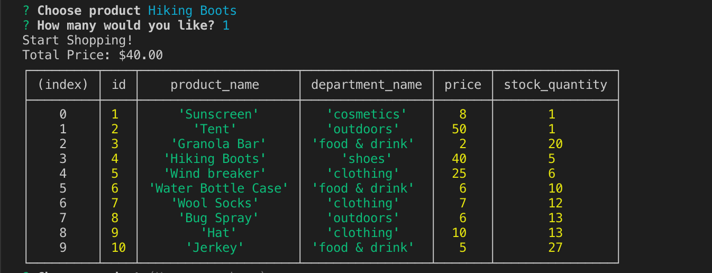
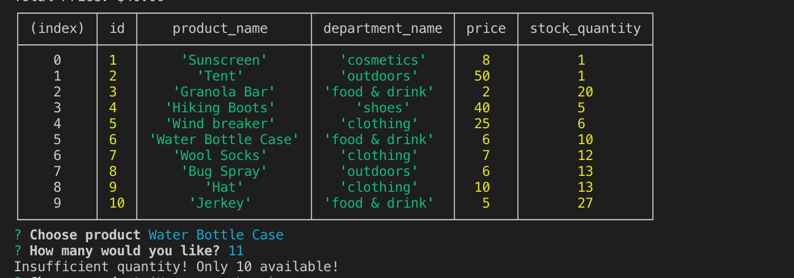

# Bamazon-App

## Overview

 Bamazon is an Amazon-like storefront that takes orders from customers, depeletes stock from the stores inventory, and calculates the order total. Bamazon is a CLI application that populates data from a mySQL database and displays it in the terminal using node.js.

## Demo

----
## Commands and Outcomes

Table Display
> Upon opening the app, the products table is displayed. This table was created by configuring node to a mySQL database which contained the products and their information. 

Selecting a Product
> The user is prompted to chose a product and enter the desired quantity. If there is enough in stock, the quantity in the database updates and the users order is completed. 

Insufficient Quantity
> If there is not enough in stock, the user is alerted and prompted to select a different item.

----
## How to Use
This is a CLI app that runs in the users terminal. In order to test it, mySQL and Inquirer must be installed in the directory where the files are downloaded. To download the packages, enter the following commands into terminal:

    npm install mysql
    npm install inquirer 

Additonally, the user must download MySQL Workbench and create an account. To run the app, enter the password into the connection.js file.